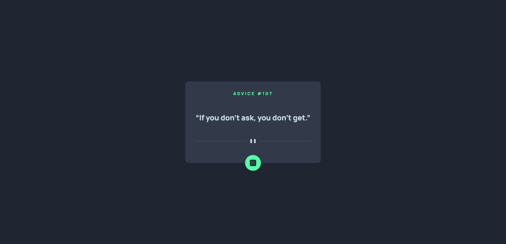
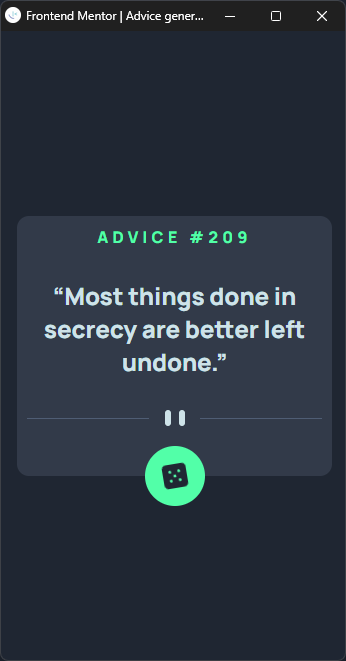

# Frontend Mentor - Advice generator app solution


This is a solution to the [Advice generator app challenge on Frontend Mentor](https://www.frontendmentor.io/challenges/advice-generator-app-QdUG-13db). Frontend Mentor challenges help you improve your coding skills by building realistic projects.

## Table of contents

- [Overview](#overview)
  - [The challenge](#the-challenge)
  - [Screenshot](#screenshot)
  - [Links](#links)
- [My process](#my-process)
  - [Built with](#built-with)
  - [What I learned](#what-i-learned)
- [Author](#author)

**Note: Delete this note and update the table of contents based on what sections you keep.**

## Overview

### The challenge

Users should be able to:

- View the optimal layout for the app depending on their device's screen size
- See hover states for all interactive elements on the page
- Generate a new piece of advice by clicking the dice icon

### Screenshot


-  1. Desktop Preview;

    

- 2. Mobile Preview;   

    


### Links

- Solution URL: [Github Repo for Solution](https://github.com/ravindra135/FrontEndMentor-advice-generator-app-main)
- Live Site URL: [Check Live Here](https://ravindra135.github.io/FrontEndMentor-advice-generator-app-main/)

## My process

### Built with

- HTML5
- CSS
- JS

### What I learned

- **Use Case of Asynvc, Await and Fetch;**

    ```js
    const fetchAdvice = async () => {
        const res = await fetch('https://api.adviceslip.com/advice');
        const data = await res.json();
        console.log(data);
    }
    ```

- **Dice Rotation**

    To make project look fancy, just added a little bit of Rotation effect to Image.

    ```css
    .btn img {
        animation-name: spin;
        animation-duration: 4000ms;
        animation-iteration-count: infinite;
        animation-timing-function: linear; 
        }
        @keyframes spin {
            from {
                transform:rotate(0deg);
            }
            to {
                transform:rotate(360deg);
            }
        }

    /* Supported by Major Browsers */
    ```

## Author

- GitHub - [Github @ravindra135](https://github.com/ravindra135/)
- Frontend Mentor - [@ravindra135](https://www.frontendmentor.io/profile/ravindra135)
- Instagram - [@ravindra_since2k](https://www.instagram.com/ravindra_since2k/)

